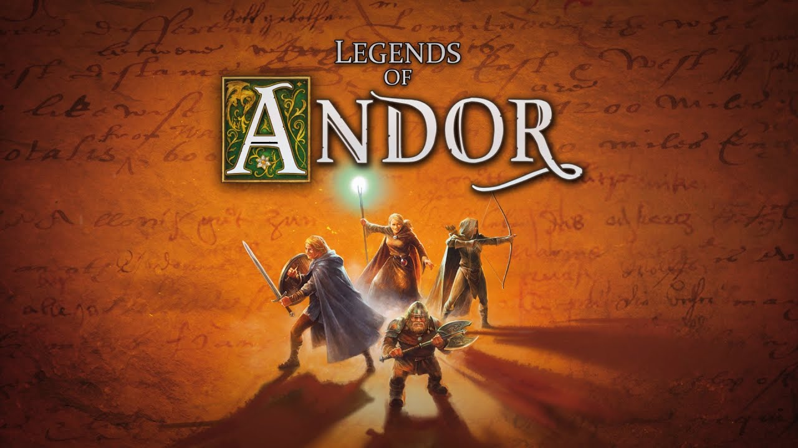
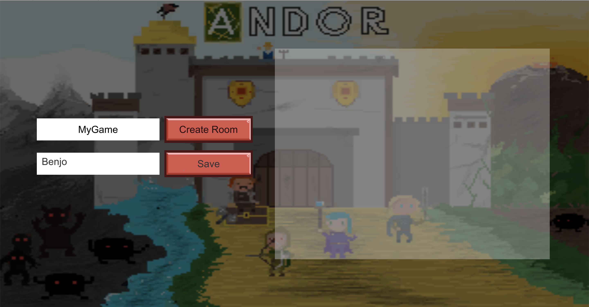
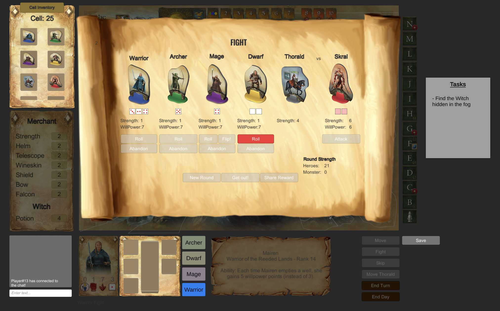
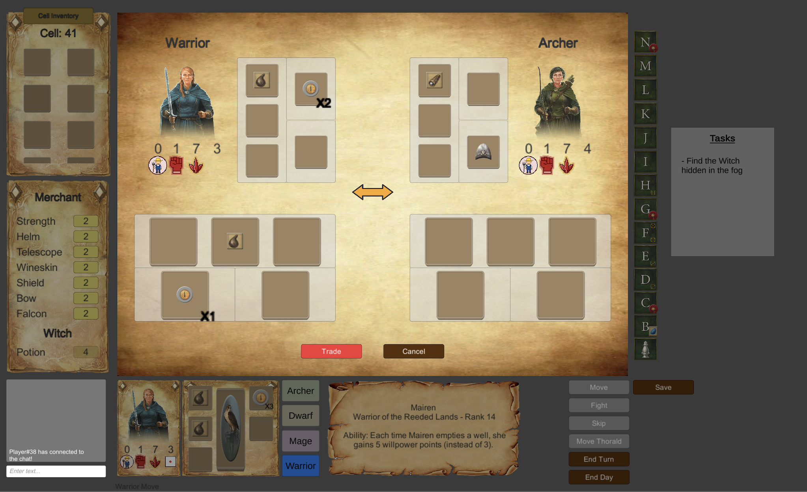

# Legends of Andor 

This project aims to create a virtual instance of the  board game [Legends of Andor](https://boardgamegeek.com/boardgame/127398/legends-andor)
using the Unity platform and C# programming language. The game is multiplayer, online and implements the original game rules such as character movement, fighting monsters, trading items, etc.

The game manual can be viewed [here](./Doc/AndorManual.pdf)

## Contributors
- [@dbenjohockey](https://github.com/dbenjohockey)
- [@hamzasalah21](https://github.com/hamzasalah21)
- [@laemtl](https://github.com/laemtl)
- [@richcs](https://github.com/richcs)

## Installation

The project was developed on Unity version 2019.3.7f1

To play the game, import the project folder to Unity and do a "PC, Mac & Linux Standalone" build. 

## Features

### Lobby

The project uses the Photon Unity Networking (PUN) package to connect players online, allow message chatting, and synchronize the state of the game.

### UI

The UI was designed to replicate the look and feel of the original game. It was made to be intuitive and to guide the player along the game.

### Move
When Moving, a player will see all the cases he can move too. Highlighted in red are the cases which will cost him willpower, In black, are the unreachable cases.

### Fight
When fighting, a player will have a visual representation of the fight. Allowing him to know who is involve and what possible actions he has.

### Trade
When trading, a player will have a visual representation of all the elements that may possibly be in the trade. The non traded objects are featured at the top of the screen and the traded objects are featured at the bottom of the screen.

